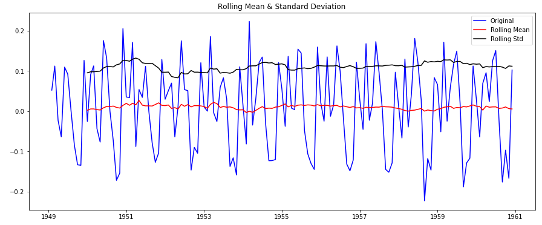

## Time Serial

Pandas - Time serial

## 目录

1.时间序列分析
2.加载和处理时间序列
3.检验时间序列是否平稳
4.非平稳时间序列转换为平稳时间序列
5.时间序列预测

## Data

[AirPassengers](./data/AirPassengers.csv)

## 简要

时间序列(Time Series)数据是一种特殊类型的数据，在金融、气象等领域应用广泛，对时间序列分析被称作为时间序列分析(Time Series Analysis, TSA)。我们经常需要对一个时间序列的未来做一个预测，其中ARIMA模型是最基本也是适应较广的预测模型(像股价预测这种复杂的时间序列除外)。

## 1.时间序列的特殊性

时间序列是以恒定的时间间隔收集的数据点的集合。对这些进行分析，可以确定长期趋势，以预测未来或进行其他形式的分析。其特殊性主要为以下两点

- 时间序列是时间依赖的(time dependent)。而独线性回归模型观察点之间相互独立的基本假设是不成立的。
- 随着增长或减少的趋势，大多数时间序列具有某种形式的周期性趋势，即特定时间段有特有的变化规律。例如，如果分析羊毛外套的销量随时间的变化，我们会发现在每一年的冬季该销量最高，其余季节较低。

由于时间序列的固有属性，建模前需要有一些与其他数据分析不同的预处理步骤。在Python中加载一个时间序列对象并对它进行分析。这里使用的数据集是经典的[AirPassengers.csv](./data/AirPassengers.csv)数据集，这个数据集在R语言中也是自带的基本数据集之一。该数据集统计了某航空公司每月国际航班的乘客数量。

## 2.使用Pandas加载和处理时间序列

### 导入库

```
import pandas as pd
import numpy as np
import matplotlib.pylab as plt
%matplotlib inline
from matplotlib.pylab import rcParams
rcParams['figure.figsize'] = 15, 6
```

### 加载数据集

```
data = pd.read_csv('./data/AirPassengers.csv')
print data.head()
print '\nData Types:'
print data.dtypes
```

outputs:


```
Month  #Passengers
0  1949-01          112
1  1949-02          118
2  1949-03          132
3  1949-04          129
4  1949-05          121

Data Types:
Month          object
#Passengers     int64
dtype: object
```

数据包含特定月份的乘客人数。但是，由于数据类型为object和int，因此pandas并不会将其视为时间序列对象。为了以时间序列读取数据，我们必须将特殊参数传递给read_csv()函数：

```
dateparse = lambda dates: pd.datetime.strptime(dates,'%Y-%m')
data = pd.read_csv('./input/AirPassengers.csv', parse_dates=['Month'], index_col='Month',date_parser=dateparse)
print data.head()
```

```
 #Passengers
Month                  
1949-01-01          112
1949-02-01          118
1949-03-01          132
1949-04-01          129
1949-05-01          121
```

read_csv()的参数:


- parse_dates：指定包含日期-时间信息的列。如上所述，列名称为Month。
- index_col：使用pandas进行时间序列分析的一个关键思想是，索引必须是描述日期-时间信息的变量。所以需要让p使用Month列作为索引。
- date_parser：指定将输入字符串转换为datetime变量的函数。 默认pandas以“YYYY-MM-DD HH：MM：SS”格式读取数据。如果数据不是这种格式，则格式必须手动定义。

数据具有作为索引的时间对象和#Passengers作为列。我们可以使用以下命令检查索引的数据及其类型：

```
data.index
```

```
DatetimeIndex(['1949-01-01', '1949-02-01', '1949-03-01', '1949-04-01',
               '1949-05-01', '1949-06-01', '1949-07-01', '1949-08-01',
               '1949-09-01', '1949-10-01',
               ...
               '1960-03-01', '1960-04-01', '1960-05-01', '1960-06-01',
               '1960-07-01', '1960-08-01', '1960-09-01', '1960-10-01',
               '1960-11-01', '1960-12-01'],
              dtype='datetime64[ns]', name=u'Month', length=144, freq=None)
```

dtype ='datetime [ns]'，表明它索引是一个datetime对象。将列转换为Series对象，以防止在每次使用时间序列时必须指定列名。

```
ts = data['#Passengers']
ts.head(5)
```

```
Month
1949-01-01    112
1949-02-01    118
1949-03-01    132
1949-04-01    129
1949-05-01    121
Name: #Passengers, dtype: int64
```

### 时间序列数据索引

#### 索引方式1 - 使用字符串索引

```
ts['1949-01-01']
```

索引结果

```
112
```

#### 索引方式2 - 导入datetime库并使用datetime函数

```
from datetime import datetime
ts[datetime(1949,1,1)]
```

索引结果

```
112
```

### 时间序列切片

#### 切片方式1 - datetime索引

```
ts['1949-01-01':'1949-05-01']
```

#### 切片方式2 - 数值索引

```
ts[0:5]
```

#### 切片方式3 - 时间索引

```
ts['1949']
```

将得到一年的信息

## 检验时间序列的平稳性

统计学中，如果时间序列的统计特性如均值、方差随时间保持不变，则称该时间序列是平稳时间序列(stationary series)。而非平稳序列(non-stationary series)是指包含趋势性、季节性或周期性等特性的序列，它可能只含有其中的一种成分，也可能是几种成分的组合。检测平稳性是时间序列模型的一个前提条件。如果一个时间序列随着时间的推移有一个特定的行为，那么我们利用该行为去对未来进行预测。此外，与非平稳序列相比，平稳序列相关的理论更成熟，更易于实施。

平稳性有严格的条件的。为了实际的目的，我们可以假设序列平稳，如果随着时间的推移具有稳定的统计特性，比如：

- 同一均值
- 恒定方差
- 不依赖于时间的自动协方差

### 检验平稳时间序列

#### 画出数据图

```
plt.plot(ts)
```


**从图中观察得，随季节变化，数据总体呈上升趋势。然而，在大多数情况下我们并不能直接通过直接观察得出时间序列是否为平稳时间序列。所以，更严格地，我们可以使用以下方法来检验平稳性：**

- 方案一： 绘制滚动统计(rolling statistics)：我们可以绘制移动平均值或移动方差，来看它是否随时间变化。通过移动平均值/方差，意味着在任何时刻 tt ，我们可以采用去年的平均值/方差，即过去12个月(也可以采用一个季度的方式)。这其实是为了便于我们观察的一种视觉技巧。

- 方案二： Dickey-Fuller检验：这是检验平稳性的统计检验方式之一。这里的零假设是时间序列是非平稳的。检验结果包括检验统计量和在某个置信水平下的临界值。如果“检验统计量”小于“临界值”，我们可以拒绝零假设，并说这个时间序列是平稳的。

**使用函数将滚动统计图和Dickey-Fuller测试结果封装，并将时间序列作为输入。此处是标准差以保持单位与均值相同。**

```
from statsmodels.tsa.stattools import adfuller
def test_stationarity(timeseries):
    
    # 计算移动平均和移动标准差
    rolmean = timeseries.rolling(window=12).mean()
    rolstd = timeseries.rolling(window=12).std()

    # 绘制图形
    orig = plt.plot(timeseries, color='blue',label='Original')
    mean = plt.plot(rolmean, color='red', label='Rolling Mean')
    std = plt.plot(rolstd, color='black', label = 'Rolling Std')
    plt.legend(loc='best')
    plt.title('Rolling Mean & Standard Deviation')
    plt.show(block=False)
    
    # 执行 Dickey-Fuller 检验
    print 'Results of Dickey-Fuller Test:'
    dftest = adfuller(timeseries, autolag='AIC')
    dfoutput = pd.Series(dftest[0:4], index=['Test Statistic',
                                             'p-value',
                                             '#Lags Used',
                                             'Number of Observations Used'])
    for key,value in dftest[4].items():
        dfoutput['Critical Value (%s)'%key] = value
    print dfoutput
```

```
test_stationarity(ts)
```


```
Results of Dickey-Fuller Test:
Test Statistic                   0.815369
p-value                          0.991880
#Lags Used                      13.000000
Number of Observations Used    130.000000
Critical Value (5%)             -2.884042
Critical Value (1%)             -3.481682
Critical Value (10%)            -2.578770
dtype: float64
```

虽然标准差的变化很小，但随着时间的推移，平均值明显增加，所以这不是一个平稳的时间序列。此外，检验统计量超过临界值，接受零假设：该时间序列是非平稳时间序列。

## 将非平稳时间序列转换为平稳时间序列

虽然在许多时间序列模型中采用了平稳性假设，但几乎没有一个实际的时间序列是平稳的。统计学家已经找到了许多将时间序列转换为平稳时间序列的方法。现实中几乎没有平稳时间序列，一般我们将他们转换为平稳时间序列。

非平稳因素主要由两个方面造成：

- 趋势： 随着时间的推移而变化。 如在数据中，乘客人数一直在增长。
- 周期性： 特定时间段的变化。 如羽绒服的销量在冬季最高，在其他季节比较低，每年都是如此。

通过建模的方法估计时间序列中的趋势和季节性，将其从时间序列中删除以获得平稳的时间系列。在这个平稳时间序列上进行预测。最后一步再通过趋势和周期性将预测值转换回原始的序列模式下，即是最终的预测值。

### 估计与消除趋势

消除趋势的第一个技巧就是做数据转换。从原始实践序列图形可以看出，这是一个明显的正向增长趋势。所以我们可以应用转换，对更高的值进行更多的“惩罚”。这些转换包括使用对数、平方根、三次方根等形式进行变换。这里进行对数变换:

```
ts_log = np.log(ts)
plt.plot(ts_log)
```


在对数变换之后，很容易看到数据的向前的趋势，并且上升趋势程度降低了(相同时间段内纵坐标的变化值)。但是在噪音的存在下它不是很直观。可以使用一些技术来估计或模拟这种趋势，然后将其从系列中删除。 实现的方法有很多，最常用的有：

- 汇总(Aggregation)： 只使用一个时间段(如每月、每周)的平均值
- 平滑(Smoothing)： 滚动平均线
- 多项式拟合(Polynomial Fitting)： 拟合一个回归模型

这里使用平滑的方法

### 移动平均

根据时间序列的一个周期长度，对连续的k个取值进行平均，作为该时间窗口内最后一个样本点的取值。 使用对过去一年的取值进行平均，即k为12。

```
moving_avg = ts_log.rolling(12).mean()
plt.plot(ts_log)
plt.plot(moving_avg, color='red')
```


红线为滚动平均值。从原始序列(ts_log)中去掉这一部分。 由于取平均值为连续的12个值且作为最后一个时间点的值，所以最前面的11个时间点没有值：

```
Month
1949-01-01         NaN
1949-02-01         NaN
1949-03-01         NaN
1949-04-01         NaN
1949-05-01         NaN
1949-06-01         NaN
1949-07-01         NaN
1949-08-01         NaN
1949-09-01         NaN
1949-10-01         NaN
1949-11-01         NaN
1949-12-01   -0.065494
Name: #Passengers, dtype: float64
```

前11个是缺失值标识NaN。我们现在丢弃掉这些NaN值，再来检验一下现在的时间序列的平稳性：

```
ts_log_moving_avg_diff.dropna(inplace=True)
test_stationarity(ts_log_moving_avg_diff)
```


```
Results of Dickey-Fuller Test:
Test Statistic                  -3.162908
p-value                          0.022235
#Lags Used                      13.000000
Number of Observations Used    119.000000
Critical Value (5%)             -2.886151
Critical Value (1%)             -3.486535
Critical Value (10%)            -2.579896
dtype: float64
```

整个时间序列看起来更像是一个平稳时间序列了。滚动平均值和方差略有变化，但没有一个明显的趋势。检验统计量小于5％临界值，所以我们在95%的置信度下可以说这是一个平稳的时间序列。

然而，这种特定方法的缺点是必须严格限定连续时间段。我们可以取每年平均，但在复杂的情况下，如预测股票价格，难以想出一个数字。所以采取加权移动平均的办法，其中更近的值被赋予更高的权重。也可以有另外分配权重的方法。 比较流行的方法是采用指数加权移动平均，即使用衰减因子来分配权重。pandas中的实现如下：

```
expwighted_avg = ts_log.ewm(halflife=12).mean()
plt.plot(ts_log)
plt.plot(expwighted_avg, color='red')
```


这里使用参数“半衰期”halflife来定义指数衰减量。这是一个假设，在很大程度上取决于业务领域。其他参数如跨度span和质心com也可用于定义不同的权重衰减。现在从时间序列中删除指数加权移动平均并得到的结果序列的检验平稳性：

```
ts_log_ewma_diff = ts_log - expwighted_avg
test_stationarity(ts_log_ewma_diff)
```


```
Results of Dickey-Fuller Test:
Test Statistic                  -3.601262
p-value                          0.005737
#Lags Used                      13.000000
Number of Observations Used    130.000000
Critical Value (5%)             -2.884042
Critical Value (1%)             -3.481682
Critical Value (10%)            -2.578770
dtype: float64
```

该时间序列在平均值和标准差方面具有更小的变化。检验统计量小于1%临界值，优于前一个在移动平均下得到的时间序列。在这种情况下，将不会有任何缺失值，每个时间点的值都使用了所有的样本值，只不过在计算不同时间点时，不同样本点的权重不同。

### 消除趋势和周期性

简单的消除趋势技术不是在所有的情况下都适用，尤其是具有高周期性情形下，需要同时消除趋势和周期性, 有两个办法：

- 差分(differencing) - 对特定时延下的两个数据进行差分
- 分解(decomposition) - 对趋势和周期性进行建模，并将其从模型中移除

#### 差分

处理趋势和周期性的最常用方法之一是差分。将特定时刻的观察值与上一个时刻的观察值结果进行差分。这种方法大多在改善平稳性方面效果很好。

```
ts_log_diff = ts_log - ts_log.shift()
plt.plot(ts_log_diff)
```


趋势性有所下降。平稳性：

```
ts_log_diff.dropna(inplace=True)
test_stationarity(ts_log_diff)
```



```
Results of Dickey-Fuller Test:
Test Statistic                  -2.717131
p-value                          0.071121
#Lags Used                      14.000000
Number of Observations Used    128.000000
Critical Value (5%)             -2.884398
Critical Value (1%)             -3.482501
Critical Value (10%)            -2.578960
dtype: float64
```

可以看到，平均值和标准差随时间变化很小。 Dickey-Fuller检验统计量小于10％临界值，因此时间序列是平稳的，具有90％的置信度(这其实不是一个比较好的结果，相较于之前指数加权移动平均的结果——95%)。 我们也可以采取二或三阶差异，这在某些应用中可能会获得更好的结果。

#### 分解

在这种方法中，趋势和周期性是分开建模的，去除这两个部分后的剩余部分将作为最终的时间序列。 通过statsmodels.tsa.seasonal中的seasonal_decompose分解并将各个部分绘图：

```
from statsmodels.tsa.seasonal import seasonal_decompose
decomposition = seasonal_decompose(ts_log)

trend = decomposition.trend
seasonal = decomposition.seasonal
residual = decomposition.resid

plt.subplot(411)
plt.plot(ts_log, label='Original')
plt.legend(loc='best')
plt.subplot(412)
plt.plot(trend, label='Trend')
plt.legend(loc='best')
plt.subplot(413)
plt.plot(seasonal,label='Seasonality')
plt.legend(loc='best')
plt.subplot(414)
plt.plot(residual, label='Residuals')
plt.legend(loc='best')
plt.tight_layout()
```


